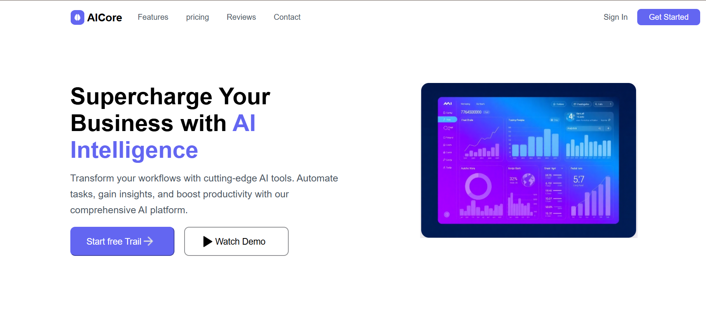
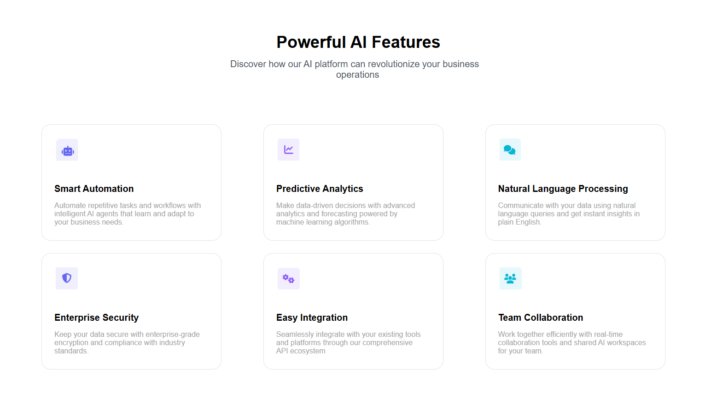
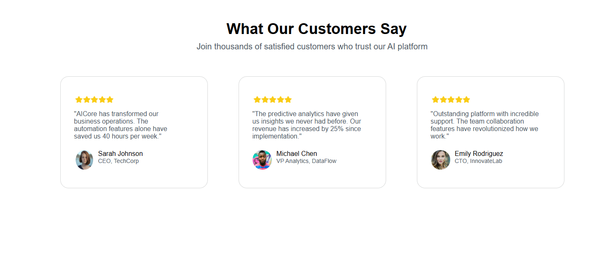

# 🤖 AI SaaS Landing Page

A modern and fully responsive landing page designed for an AI-powered business platform. This project showcases a clean UI, structured layout, and real-world SaaS design patterns commonly used in industry-level applications.

---

## 🌐 Live Demo

🔗 https://ai-saas-landing-page-theta.vercel.app

---

## ✨ Features

* 🎯 Modern and professional UI design
* 📱 Fully responsive (Mobile, Tablet, Desktop)
* ⚡ Smooth layout with clear section flow
* 🧩 Reusable and clean component structure
* 🎨 Attractive hero section and call-to-actions

---

## 📌 Sections Included

* 🔹 Hero Section (Product introduction)
* 🔹 Features Section (AI capabilities)
* 🔹 Testimonials Section (Customer feedback)
* 🔹 Call-To-Action (Start free trial & demo)

---

## 🛠 Tech Stack

* HTML5
* CSS3
* JavaScript

---

## 📸 Screenshots





---

## 🚀 Deployment

This project is deployed using **Vercel** for fast and reliable hosting.

---

## 💡 What I Learned

* Structuring real-world SaaS landing pages
* Improving UI/UX design skills
* Writing clean and maintainable CSS
* Making responsive layouts using modern techniques

---

## 🔮 Future Improvements

* 🌙 Add Dark Mode
* 📩 Add functional contact/signup form
* 🔗 Integrate backend for real data
* 🎬 Add animations for better user experience

---

## 📂 Project Setup

To run this project locally:

```bash
git clone https://github.com/Pavishini/ai-saas-landing-page.git
cd ai-saas-landing-page
open index.html
```

---

## 👩‍💻 Author

**Pavishini**

---

## ⭐ Show Your Support

If you like this project, consider giving it a ⭐ on GitHub!
